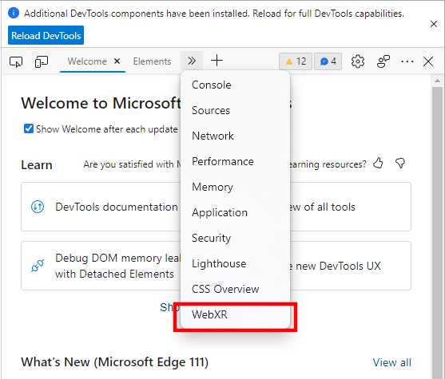

## CSD3120 Team Project

### The awesome people who developed this

- 2000899 PEH SHI HAO
- 2001003 BORIS YEN FU SHENG
- 2001062 SEE YONG LI
- 2001145 PHANG JIA RONG
- 2001908 OW XIN RUI
- 2001984 RYAN-CECIL LIM XUAN XIAN
- 2000681 EE XUAN EN, ARVIN

We present to you..

# ZombieChemChem

**About the game**

A survival zombie game made for WebXR in Unity, using VRTK4 and Unity store assets.

This is a school project developed by students under CSD3120, DigiPen Singapore's Introduction to Virtual Reality module.

**Story**

You are a scientist struggling to survive in a post apocalyptic world. Chemical zombies are being sent your way! Fortunately, you know the secret to repelling the zombies:

They react negatively to certain atoms and molecules!

Craft the right atoms and molecules at your special work desk. Load the atoms or molecules onto your augmented gun and fire them at the zombies!

Survive for as long as possible, whilst learning about atoms and molecule creation!

## Link to the game

>INSERT LINK HERE TO WHOEVER HOSTING THE SITE

## Prerequisites to play

You would need the Edge web browser with the [**Immersive Web Emulator Plugin**](https://microsoftedge.microsoft.com/addons/detail/immersive-web-emulator/hhlkbhldhffpeibcfggfndbkfohndamj). 

A Quest 2 can also be used to play the game in the web browser. (TODO: double check testing for this)

### Instructions to play on the Edge web browser

Press F12 to access dev tools and navigate to **WebXR** on the top bar



Press the VR button and you're ready to play!


Alternatively, connect your Quest 2 to your computer or laptop and play it on the browser! (TODO: again, double check testing for this)

## How to play

**Goal of the game**
- Learn to create real life molecules using a combination of Hydrogen, Oxygen and Carbon atoms
- Use the gun tp fire atoms and molecules at the zombies

**Creating the atoms**
- Use the **grab action button** on the "H", "C", "O" buttons on the chalkboard to create the Hydrogen, Carbon and Oxygen atoms respectively

**Creating the molecules**
- Bring an atom toward the circular indicators on the chalkboard to prime them for combining
- Use the **grab action button** on the "Create" button on the chalkboard to create the corresponding molecule from the combination of atoms

**Other chalkboard interactions**
- "Change scene" button progresses the game to a different, more difficult scene with more zombies.

**Gun interactions**
- Use the grab action button when hovering over the gun to snap the gun into your hand
- Aim the gun by moving your controller around
- Use the **right trigger button** to fire the gun
- You can only have 1 atom or molecule loaded at a time

**Loading the gun**
- Grab an atom or molecule and bring it to the gun's lower barrel area, indicated with a highlighted zone. This will automatically load the gun with the atom or molecule

**Zombie interactions**
- Molecules destroy zombies on contact if they are weak to it
- Zombies will have an indication above their heads for what they are weak towards

**Molecule interactions**
The following molecules that can be created using the chalkboard are as follows:
```
1. Hydrogen Gas (H2)
2. Oxygen Gas (O2)
3. Water (H2O) 
4. Hydrogen Peroxide (H2O2)
5. Carbon Monoxide (CO)
6. Carbon Dioxide (CO2)
7. Methane (CH4)
8. Acetylene (C2H2)
9. Ethene (C2H4)
```
- You can also grab the atoms and molecules using the grab action button (and throw them at the zombies)

**Barricades**
- These barricades get destroyed over time as the zombies hack away at them
- Firing or throwing a C2H4 molecule (a molecule used in creating plastic) at a barricade repairs it

## Locomotion method of choice

- Walk around the scene by pushing the left thumbstick in different directions
- You can also teleport by: 
	1. Holding down the right thumbstick
	2. Aiming at a location
	3. Then releasing it to teleport to the target location

## Scripts created for the game

All scripts we've developed for this game are included in ```../Assets/Scripts```

These scripts exclude those imported from VRTK and other packages.
- TODO: Remember to do headers and comments for your code.

## Assets accreditation

**Overall scene decorations:**
https://assetstore.unity.com/packages/3d/environments/low-poly-survival-modular-kit-vr-and-mobile-128903

**Zombie model:**
https://assetstore.unity.com/packages/3d/characters/humanoids/simple-zombies-cartoon-characters-27935

**Gun model:**
https://assetstore.unity.com/packages/3d/characters/simple-military-cartoon-war-34497

**Atoms and molecule models:**
TODO: ??? Where these molecule models from ???

**Sounds:**
DigiPen Metadigger library

## Future plans

- Currently you will not die, or lose in the game
- Health bar UI that follows player view

## Contributions from each member

#### PEH SHI HAO
- Gun interaction and logic
- Playtesting

#### BORIS YEN FU SHENG
- Report
- Readme file
- Playtesting

#### SEE YONG LI
- Report
- Population of level 2
- Barricade interactions and logic

#### PHANG JIA RONG
- Chalkboard interactions and logic
- Atom and molecule interactions and logic

#### OW XIN RUI
- Video demo
- Playtesting

#### RYAN-CECIL LIM XUAN XIAN
- Report
- Population of level 1
- Playtesting

#### EE XUAN EN, ARVIN
- Report
- Zombie interactions and logic
- Zombie spawners
